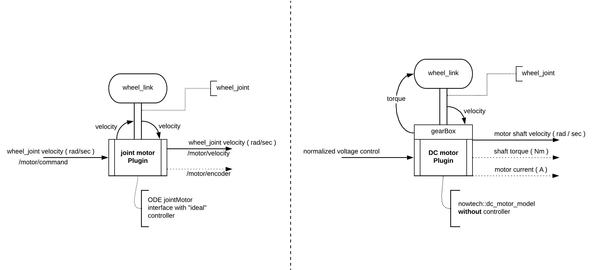
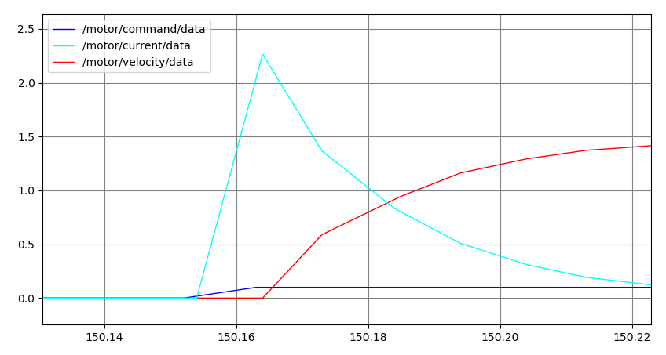
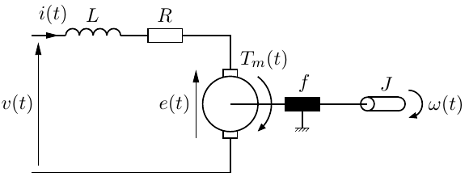
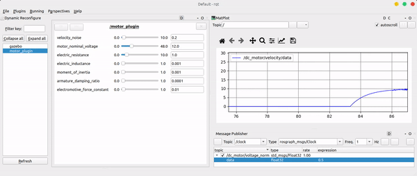
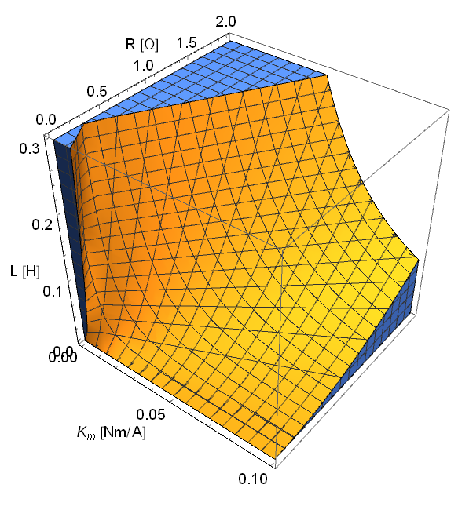
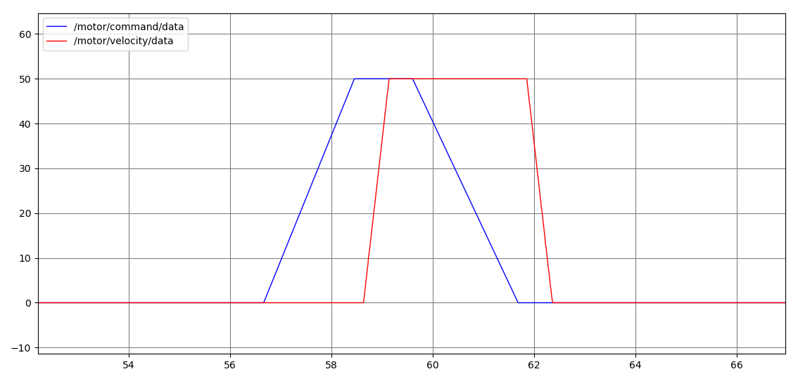

# Gazebo ROS motor plugins

This repository contains currently <u>two</u> motor plugins, one with an ideal speed controller and one without a controller that models a DC motor. *Planning to extend the package with AC, BLDC, stepper and servo motor models as well...*



## DC motor plugin

This plugin is trying to estimate a parametric DC motor by the solution of it's electro-mechanical differential equations, exposing the virtual motor's current consumption and torque interfaces as topics. It has been designed to allow motor control system development in ROS nodes utilizing the physics engine of Gazebo.



### Electro-mechanical model




From Kirchoff's voltage law:


By Newton's law:


Electro-mechanical coupling:


Where  is the electromotive constant and back EMF (e) is proportional to the shaft angular velocity, and  is the torque constant while the torque (T) is proportional to actual motor current. The mechanical power produced by the DC motor is . The electric power  delivered by the source goes into heat loss in the resistance , into stored magnetic energy in the inductance  and the remaining quantity  is converted in mechanical energy . It leads to  whether  *( Chiasson 2005 ).* *Model description by [INSA Lyon.](http://www.ctrl-elec.fr/en/ctrl-elec/motor-control/dc-motor-control/84-2/)*

### Simulator interface

The controlled input for the DC motor model is the **normalized** **voltage** that is applied to the motor's electrical connectors, environmental inputs are the shaft velocity and the external load torque on the shaft. Output is the electromotive force produced by the virtual motor.

```c++
applied_torque.Z() = Km * i_t * gear_ratio_; // motor torque T_ext = K * i * n_gear
this->link_->AddRelativeTorque(applied_torque);
joint_->GetForceTorque( 0u ); // get external load
joint_->GetVelocity( 0u ); // get shaft angular velocity
```

#### Advantages of applying torque on the link

- Supported on all physics engines
- Object feels the force that accelerates it
- Can undershoot or overshoot the target velocity *( ideal for controller development )*
- Shaft's damping and friction can be set as joint properties

### Usage

Just use the **dc_motor** macro in a descriptor file as if it were a joint:

```xml
  <xacro:include filename="$(find gazebo_ros_motors)/xacro/dc_motor.xacro"/>
  <xacro:dc_motor motor_name="dc_motor" parent_link="base_link" child_link="wheel_link">
    <xacro:property name="params_yaml" value="$(find gazebo_ros_motors)/params/dc_motor.yaml"/>
    <origin xyz="0 0 0.2" rpy="0 0 0"/>
  </xacro:dc_motor>
```

Plugin parameters are loaded from a **yaml** file *( defaults are close to a 24V / 450W wheelchair motor )*:

```yaml
# topics
publish_velocity: true
publish_encoder:  false
publish_current:  true
publish_motor_joint_state: false
update_rate: 100.0
# motor model
motor_nominal_voltage: 24.0 # Volts
moment_of_inertia: 0.001 # kgm^2
armature_damping_ratio: 0.0001 # Nm/(rad/s)
electromotive_force_constant: 0.08 # Nm/A
electric_resistance: 1.0 # Ohm
electric_inductance: 0.001 # Henry
# transmission
gear_ratio: 20.0
joint_damping: 0.005
joint_friction: 0.01
# shaft encoder
encoder_ppr: 4096
velocity_noise: 0.0
```

#### Dynamic reconfiguration

Aforementioned DC motor parameters can be set through dynamic reconfiguration server as well.



#### Parameter check

If the parameters would produce an instable state in the solvers update function the plugin is going to restrict the changes to the last stable parameter set. The solvers stable parameter space looks like this - assuming the armature damping and moment of inertia is unchanged:

 


#### ROS Topics

**Subscriber**

- **/motor/command**  -- normalized voltage, scales to **motor_nominal_voltage** parameter

**Publishers**

- **/motor/velocity** -- motor shaft velocity *(encoder side, before gearbox)* **( rad / sec )**
- **/motor/encoder** -- encoder counter 
- **/motor/current** -- electrical current flowing on the coil


## ODE joint motor plugin

This plugin is using the Open Dynamics Engine's joint motor interface, that implements an ideal speed controller. The reason behind a single velocity encoded motor was to allow the development of parametric multi-actuated kinematic models *(E.g. 3 omni wheel geometry )* without the need to tune a controller.

### Simulator interface

The plugin's input is the desired angular velocity of the motor joint, and the maximum force the ODE joint-motor may apply during a time step as parameter. 

```c++
joint_->SetParam("fmax", 0, motor_fmax_); // set max. force applied per time step
joint_->SetParam("vel",  0, input_); // set shaft angular velocity 
joint_->GetVelocity( 0u )*encoder_to_shaft_ratio_; // read joint velocity 
```

### Usage

Just use the **joint_motor** macro in a descriptor file as if it were a joint:

```xml
  <xacro:include filename="$(find gazebo_ros_motors)/xacro/joint_motor.xacro"/>
  <xacro:joint_motor motor_name="ode_motor" parent_link="base_link" child_link="wheel_link">
    <xacro:property name="params_yaml" value="$(find gazebo_ros_motors)/params/joint_motor.yaml"/>
    <origin xyz="0 0 0.2" rpy="0 0 0"/>
  </xacro:joint_motor>
```

Plugin parameters are loaded from a **yaml** file:

```yaml
# ODE joint motor
ode_joint_motor_fmax: 50.0
ode_joint_fudge_factor: 1.0
# transmission
joint_damping: 0.005
joint_friction: 0.01
# shaft encoder
encoder_ppr: 4096
encoder_to_shaft_ratio: 1.0
```

More details on *fmax* and *fudge factor* can be found in the [ODE user guide](https://ode.org/ode-latest-userguide.html#sec_7_5_0). 

#### ROS Topics

**Subscriber**

- **/motor/command**  -- desired joint angular velocity **( rad / sec )**

**Publishers**

- **/motor/velocity** -- motor shaft velocity *(encoder side, before gearbox)* **( rad / sec )**
- **/motor/encoder** -- encoder counter 


##### Authors

Marton Juhasz [nilseuropa](https://github.com/nilseuropa) and Gergely Gyebroszki [gyebro](https://github.com/Gyebro)